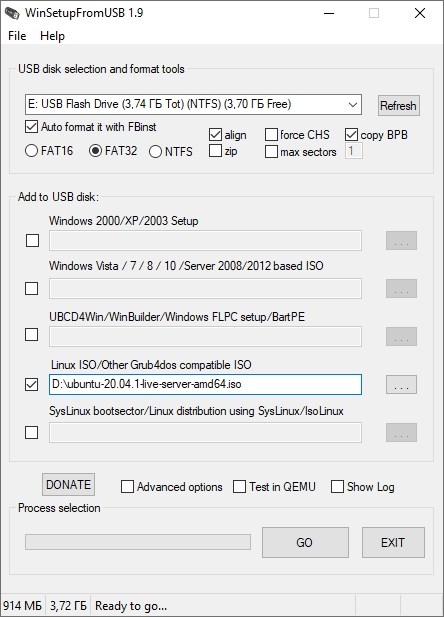

[&larr;](readme.md "Ubuntu") Домашний сервер на базе Ubuntu Server 20
---------------------------------------------------------------------

## <a name="content"></a> Содержание:

- [Создание установочной флешки](#creating-an-installation-flash-drive)
- [Установка Ubuntu Server](#installing-ubuntu-server)
- [Базовая настройка Ubuntu Server](#basic-ubuntu-server-setup)
    - [Обновление системы](#system-update)
    - [Статический IP-адрес](#static-ip-address)
    - [Настройка SSH-сервера](#setting-up-an-ssh-server)
    - [Настройка времени](#time-setting)
    - [Установка вспомогательных программ](#installing-auxiliary-programs)
- [Установка Webmin](#installing-webmin)
- [Источники](#sources)

## <a name="creating-an-installation-flash-drive"></a> Создание установочной флешки [&uarr;](#content "Содержание")

Заходим на сайт Ubuntu в раздел "[Загрузки](https://ubuntu.com/download/server)" и качаем последнюю версию Ubuntu Server (на текущий момент это Ubuntu Server 20.04.1 LTS).

Далее заходим на официальный сайт программы WinSetupFromUSB в раздел "[Загрузки](http://www.winsetupfromusb.com/downloads/)" и качаем последнюю версию программы WinSetupFromUSB (на текущий момент это WinSetupFromUSB 1.9).

Теперь необходимо смотрировать загрузочную флешку. Для этого вставляем флешку в USB и запускаем программу WinSetupFromUSB. В запустившейся программе указываем ранее скачанный образ Ubuntu Server.

> Флешки на 2Gb будет вполне достаточно.



После непродолжительной работы программы WinSetupFromUSB, загрузочная флека будет готова.

## <a name="installing-ubuntu-server"></a> Установка Ubuntu Server [&uarr;](#content "Содержание")

Перегружаем компьютер и запускаемся с флешки. Загружается установщик Ubuntu Server и далее следуем подсказкам установщика.

> На шаге установки SSH отмечаем галочку установки OpenSSH сервера (Install OpenSSH server).

## <a name="basic-ubuntu-server-setup"></a> Базовая настройка Ubuntu Server [&uarr;](#content "Содержание")

Логинемся в системе под доступами, которые указывали при установке Ubuntu Server.

### <a name="system-update"></a> Обновление системы [&uarr;](#content "Содержание")

Обновляем список пакетов:

```markdown
user@computer:~$ sudo apt update
```

Просматриваем список пакетов, которые требуют обновления:

```markdown
user@computer:~$ apt list --upgradable
```

Обновляем пакеты, установленные в системе:

```markdown
user@computer:~$ apt upgrade
```

### <a name="static-ip-address"></a> Статический IP-адрес [&uarr;](#content "Содержание")

Теперь компьютеру необходимо присвоить статический IP-адрес для того, чтобы в будущем подключаться к нему удаленно по SSH.

> По хорошему этот IP-адрес необходимо "зарезервировать" в роутере, чтобы он не присвоился какому-нибудь другому устройству.

Для начала ищем основной шлюз и сетевой интерфейс:

```markdown
user@computer:~$ ip route
default via <GATEWAY> dev <INTERFACE> proto static
<SUBNET> dev <INTERFACE> proto kernel scope link src <IP>
```

где:

- `<GATEWAY>` - шлюз;
- `<INTERFACE>` - сетевой интерфейс;
- `<SUBNET>` - подсеть;
- `<IP>` - IP-адрес;
 
Отсюда нам необходим `<GATEWAY>` и `<INTERFACE>`, записываем данные на листочек.

Далее ищем файл с настройками сети:

```markdown
user@computer:~$ ls /etc/netplan
<FILE_NAME>.yaml
```

где:

- `<FILE_NAME>` - наименование файла;

Открываем файл с настройками сети на редактирование с правами рута:

```markdown
user@computer:~$ sudo nano /etc/netplan/<FILE_NAME>.yaml
```

где:

- `<FILE_NAME>` - наименование файла;

В открывшемся редакторе указываем параметры сети:

```markdown
network:
  ethernets:
    <INTERFACE>:
      dhcp4: no
      dhcp6: no
      addresses: [<IP>/24, ]
      gateway4: <GATEWAY>
      nameservers:
        addresses: [<IP>, ]
  version: 2
```

где:

- `<INTERFACE>` - сетевой интерфейс;
- `<IP>` - статический IP-адрес компьютера (тот же, который "зарезервировали" в роутере);
- `<GATEWAY>` - шлюз;

> Исходный файл `/etc/netplan/<FILE_NAME>.yaml`:
> 
> ```markdown
> network:
>   ethernets:
>     <INTERFACE>:
>       dhcp4: true
>   version: 2
> ```
> где:
> 
> - `<FILE_NAME>` - наименование файла;
> - `<INTERFACE>` - сетевой интерфейс;

Применяем прописанные выше настройки:

```markdown
user@computer:~$ sudo netplan apply
```

### <a name="setting-up-an-ssh-server"></a> Настройка SSH-сервера [&uarr;](#content "Содержание")

Открываем файл конфигурации SSH-сервера:

```markdown
user@computer:~$ sudo nano /etc/ssh/sshd_config
```

Указываем порт для подключения:

> По умолчанию установлен порт 22.

```markdown
Port <NUMBER>
```

где:

- `<NUMBER>` - номер порта (не должен превышать 65535 и конфликтовать с другими сервисами в системе);

Перезапускаем SSH-сервер:

```markdown
user@computer:~$ sudo /etc/init.d/ssh restart
```

В брандмауэре разрешаем OpenSSH:

```markdown
user@computer:~$ sudo ufw allow OpenSSH
```

В брандмауэре разрешаем новый порт:

```markdown
user@computer:~$ sudo ufw allow <PORT>/tcp
```

где:

- `<PORT>` - номер порта (ранее указывали в файле `/etc/ssh/sshd_config`);

Включаем брандмауэр:

```markdown
user@computer:~$ sudo ufw enable
```

На этом компьютер готов к удаленному управлению через SSH, можно отключить от системного блока монитор и клавиатуру, а сам системный блок убрать подальше в кладовку.

> Не забываем в BIOS выключить предупреждения об ошибках обнаружения таких устройств как клавиатура или мышь.

### <a name="time-setting"></a> Настройка времени [&uarr;](#content "Содержание")

Проверяем часовой пояс (по умолчанию UTC):

```markdown
user@computer:~$ date
Sun 23 Aug 2020 07.00.00 PM UTC
```

Меняем часовой пояс:

```markdown
user@computer:~$ sudo timedatectl set-timezone Europe/Moscow
Sun 23 Aug 2020 10.01.30 PM MSK
```

Устанавливаем NTP сервер, чтобы время автоматически синхронизировалось с серверами в интернете:

```markdown
user@computer:~$ sudo apt install ntp
```

Добавляем NTP сервер в автозагрузку:

```markdown
user@computer:~$ sudo systemctl enable ntp
```

### <a name="installing-auxiliary-programs"></a> Установка вспомогательных программ [&uarr;](#content "Содержание")

Обновляем список пакетов:

```markdown
user@computer:~$ sudo apt update
```

Устанавливаем Midnight Commander:

> Midnight Commander - один из файловых менеджеров с текстовым интерфейсом типа Norton Commander для UNIX-подобных операционных систем.

```markdown
user@computer:~$ sudo apt install mc
```

Устанавливаем htop:

> htop — компьютерная программа, предназначенная для вывода на терминал списка запущенных процессов и информации о них (монитор процессов).

```markdown
user@computer:~$ sudo apt install htop
```

## <a name="installing-webmin"></a> Установка Webmin [&uarr;](#content "Содержание")

> Webmin — это программный комплекс, позволяющий администрировать операционную систему через веб-интерфейс, в большинстве случаев, позволяя обойтись без использования командной строки и запоминания системных команд и их параметров. Используя любой браузер, администратор сервера может создавать новые учётные записи пользователей, почтовые ящики, изменять настройки служб и сервисов, например: веб-сервера Apache, DNS. Однако, в некоторых случаях необходимо знание операционной системы и редактирование конфигурационных файлов вручную. Кроме того, не все возможности операционной системы и не все программы можно конфигурировать через интерфейс Webmin, например nginx пока не входит в базовый набор.
>
> Webmin состоит из простого веб-сервера и большого количества скриптов (>500), которые собственно и осуществляют связь между командами администратора через веб-интерфейс и их исполнением на уровне операционной системы и прикладных программ. Webmin написан полностью на языке Perl и не использует никаких дополнительных нестандартных модулей. Простота, лёгкость и быстрота выполнения команд — одно из самых больших преимуществ данной панели управления.
>
> Другое важное преимущество — возможность исправлять конфигурационные файлы вручную, так как Webmin не «портит» конфигурационные файлы, в отличие от некоторых других панелей управления, и следует, как правило, политикам дистрибутивов по конфигурированию программ.

Для установки Webmin можно воспользоваться инструкцией "[Установка Webmin на Ubuntu Server 20](installing-webmin-on-ubuntu-server-20.md)".

## <a name="sources"></a> Источники [&uarr;](#content "Содержание")

- [Download Ubuntu Server (ubuntu.com)](https://ubuntu.com/download/server)
- [Downloads | WinSetupFromUSB (winsetupfromusb.com)](http://www.winsetupfromusb.com/downloads/)
- [Настройка Ubuntu Server после установки (losst.ru)](https://losst.ru/nastrojka-ubuntu-server-posle-ustanovki)
- [Использование APT. Команды apt и apt-get (pingvinus.ru)](https://pingvinus.ru/note/apt)
- [How to configure static IP address on Ubuntu 20.04 Focal Fossa Desktop/Server (linuxconfig.org)](https://linuxconfig.org/how-to-configure-static-ip-address-on-ubuntu-20-04-focal-fossa-desktop-server)
- [Ubuntu Server 20.04 и 18.04 – Установка статического IP (adminguide.ru)](https://adminguide.ru/2018/09/24/ubuntu-server-18-04-%D1%83%D1%81%D1%82%D0%B0%D0%BD%D0%BE%D0%B2%D0%BA%D0%B0-%D1%81%D1%82%D0%B0%D1%82%D0%B8%D1%87%D0%B5%D1%81%D0%BA%D0%BE%D0%B3%D0%BE-ip/)
- [Задаем статический IP адрес в Ubuntu Server 20.04 (cyber-x.ru)](https://cyber-x.ru/%D0%B7%D0%B0%D0%B4%D0%B0%D0%B5%D0%BC-%D1%81%D1%82%D0%B0%D1%82%D0%B8%D1%87%D0%B5%D1%81%D0%BA%D0%B8%D0%B9-ip-%D0%B0%D0%B4%D1%80%D0%B5%D1%81-%D0%B2-ubuntu-server-20-04/)
- [Роутинг и policy-routing в Linux при помощи iproute2 (habr.com)](https://habr.com/ru/post/108690/)
- [Утилита ip Linux (losst.ru)](https://losst.ru/nastrojka-seti-v-linux)
- [Смена порта SSH-сервера как мера защиты от брутфорса (putty.org.ru)](https://putty.org.ru/articles/change-default-sshd-port.html)
- [22 порт SSH переносить или нет (habr.com)](https://habr.com/ru/post/429410/)
- [Порт SSH – как изменить и перенаправить (wordpresslib.ru)](https://wordpresslib.ru/ssh/port-ssh-kak-izmenit-i-perenapravit.html)
- [Midnight Commander (ru.wikipedia.org)](https://ru.wikipedia.org/wiki/Midnight_Commander)
- [Webmin (ru.wikipedia.org)](https://ru.wikipedia.org/wiki/Webmin)