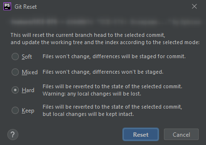

[&larr;](readme.md "Windows") Отмена последнего коммита в PhpStorm
------------------------------------------------------------------

Во вкладке `Git` переходим во внутреннюю вкладку `Log`. Находим необходимый коммит, до которого нужно вернуться, вызываем контекстное меню и нажимаем `Reset Current Branch to Here`.

В открывшемся окне представлены разные варианты восстановления. Если нужно отменить изменения и в локальных файлах, то нажимаем на `Hard`. Иначе `Mixed`. Если использовать `Soft`, как рекомендуют во многих местах, то изменения не полностью исчезнут.



> **Soft**: all changes from commits that were made after the selected commit will be staged (that means they will be moved to the Local Changes view so that you can review them and commit later if necessary).
>
> **Mixed**: changes made after the selected commit will be preserved but will not be staged for commit.
>
> **Hard**: all changes made after the selected commit will be discarded (both staged and committed).
>
> **Keep**: committed changes made after the selected commit will be discarded, but local changes will be kept intact.

После этого в удаленном репозитории всё еще останется старый вариант коммитов. Для того, чтобы внести изменения, в консоле PhpStorm'а надо написать команду:

```markdown
user@computer:~$ git push --force origin <BRANCH_NAME>
```

где:

- `<BRANCH_NAME>` - наименование ветки, куда будет происходить вливание;

После выполненных действий, коммиты будут удалены как локально, так и из удаленного репозитория.

<a name="sources"></a>
## Источники

- [Undo changes in Git repository (jetbrains.com)](https://www.jetbrains.com/help/phpstorm/undo-changes.html#reset-HEAD)
- [PhpStorm как отменить последние изменения на Git (ploshadka.net)](https://ploshadka.net/phpstorm-cancel-git/)