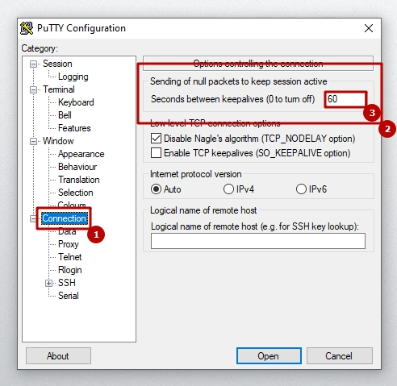

[&larr;](readme.md "Windows") Постоянные обрывы соединения в PuTTY через SSH
----------------------------------------------------------------------------

На ОС Windows очень часто в качестве SSH-клиента используется PuTTY. В этом клиенте есть настройки, позволяющие избежать разрыва SSH сессий. Блок с настройками называется "Sending of null packets to keep session active" (Отправка нулевых пакетов для поддержания активности сеанса), найти можно по следующему пути: `Connection` -> `Sending of null packets to keep session active` -> `Seconds between keepalives (0 to turn off)`. Значение для "Seconds between keepalives (0 to turn off)" ставим, к примеру, "60" и не забываем сохранить сессию.

## Источники

- [Соединение через SSH постоянно сбрасывается (pc.ru)](https://pc.ru/articles/soedinenie-cherez-ssh-postoyanno-sbrasyvaetsya-obryvaetsya#putty)