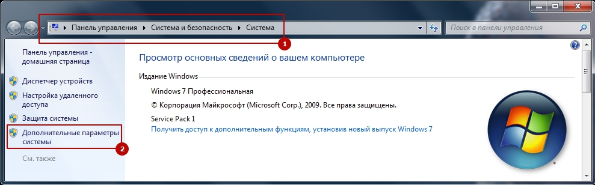
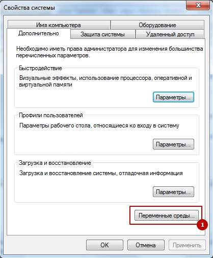
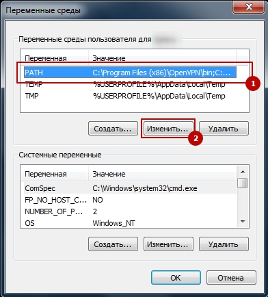
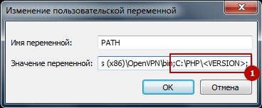

[&larr;](readme.md "Windows") Установка PHP интерпретатора в Windows 7
----------------------------------------------------------------------

Инструкция по установке последней версии PHP интерпретатора в Windows 7.

## <a name="content"></a> Содержание:

- [Скачивание PHP](#download-php)
- [Распространяемый компонент Microsoft Visual C++ для Visual Studio](#microsoft-visual-c-redistributable-for-visual-studio)
- [Размещение PHP в Windows](#hosting-php-on-windows)
- [Файл `php.ini`](#file-php-ini)
- [Проверка работы PHP](#check-php)
- [Источники](#sources)

## <a name="download-php"></a> Скачивание PHP [&uarr;](#content "Содержание")

С официального сайта PHP скачиваем zip-архив последней версии [PHP для Windows](https://windows.php.net/download/) с учетом разрядности системы (x64 или x86). В случае необходимости определенной версии PHP, ищем ее в разделе "[Archives](https://windows.php.net/downloads/releases/archives/)".

> Thread Safe VS Non Thread Safe:
> - если планируется использовать PHP на Windows через встроенный SAPI модуль WEB-сервера Apache (или другого WEB-сервера), то используем Thread Safe версию PHP, т.к. SAPI модуля WEB серверов являются много поточными и PHP может выполняться в нескольких параллельных потоках;
> - если планируется использовать PHP только как внешнее CGI или CLI приложение через FastCGI/CGI или CLI (в них PHP запускается только как параллельный процесс), то выбираем Non Thread Safe версию PHP.

## <a name="microsoft-visual-c-redistributable-for-visual-studio"></a> Распространяемый компонент Microsoft Visual C++ для Visual Studio [&uarr;](#content "Содержание")

Сборки PHP выполнены в Visual Studio (на момент публикации с пакетом VC15), поэтому для установки последней версиии PHP необходим пакет Microsoft Visual C++ 2015-2019 Redistributable, устанавливающий компоненты среды выполнения библиотек Visual C++.

Скачать пакет можно на официальном сайте Microsoft со страницы загрузки Visual Studio в разделе "Скачиваемые файлы" &#10132; "Другие инструменты и платформы" &#10132; "[Распространяемый компонент Microsoft Visual C++ для Visual Studio 2019](https://visualstudio.microsoft.com/ru/downloads/#other-ru-family)". Второй вариант, скачать со страницы поддержки Microsoft "[Последние поддерживаемые версии Visual C++ для скачивания](https://support.microsoft.com/ru-ru/help/2977003/the-latest-supported-visual-c-downloads)".

## <a name="hosting-php-on-windows"></a> Размещение PHP в Windows [&uarr;](#content "Содержание")

Распаковываем содержимое архива на диск, к примеру в папку `C:\PHP\<VERSION>` (где `<VERSION>` - номер версии PHP).

Для удобства работы с PHP через командную строку и для возможности запуска PHP из любого каталога, необходимо добавить PHP в переменные среды. Для этого:

- Заходим "Панель управления" &#10132; "Система и безопасность" &#10132; "Система" и нажимаем "Дополнительные параметры системы".  

- В открывшемся окне "Свойства системы" на закладке "Дополнительно" кликаем по кнопке "Переменные среды".  

- В открывшемся окне "Переменные среды" в блоке "Переменные среды пользователя" ищем переменную `PATH` и кликаем "Изменить".  

- В открывшемся окне "Изменение пользовательской переменной" в значении переменной через точку с запятой добавляем путь до PHP интерпритатора `C:\PHP\<VERSION>;` (где `<VERSION>` - номер версии PHP) и сохраняем изменения во всех окнах.  


## <a name="file-php-ini"></a> Файл `php.ini` [&uarr;](#content "Содержание")

Конфигурационный файл `php.ini` является основным инструментом настройки ядра PHP.

В распакованном ранее архиве есть два стандартных файла `php.ini` - это `C:\PHP\<VERSION>\php.ini-development` и `C:\PHP\<VERSION>\php.ini-production` (где `<VERSION>` - номер версии PHP).

> `php.ini-development` VS `php.ini-production`:
>
> - `php.ini-development` содержит настройки, рекомендуемые для использования при разработке;
> - `php.ini-production` содержит настройки, рекомендуемые при производственной эксплуатации;

Переименовываем файл `C:\PHP\<VERSION>\php.ini-development` или `C:\PHP\<VERSION>\php.ini-production` в `C:\PHP\<VERSION>\php.ini` (где `<VERSION>` - номер версии PHP) и, в случае необходимости, прописываем необходимые настройки.

## <a name="check-php"></a> Проверка работы PHP [&uarr;](#content "Содержание")

Для проверки корректности установки и настройки PHP, в командной строке вводим:

```markdown
php -v
```

Результатом выполнения команды `php -v` и в случае использования PHP 7.4.7 на экран будет выведено:

```markdown
PHP 7.4.7 (cli) (built: Jun  9 2020 13:34:30) ( NTS Visual C++ 2017 x64 )
Copyright (c) The PHP Group
Zend Engine v3.4.0, Copyright (c) Zend Technologies
```

## <a name="sources"></a> Источники [&uarr;](#content "Содержание")

- [Установка PHP7 на Windows (andew.ru)](https://andew.ru/ru/pages/page/install-php-on-windows)
- [Скачайте Visual Studio 2019 для Windows и Mac (visualstudio.microsoft.com)](https://visualstudio.microsoft.com/ru/downloads/#other-ru-family)
- [Последние поддерживаемые версии Visual C++ для скачивания (support.microsoft.com)](https://support.microsoft.com/ru-ru/help/2977003/the-latest-supported-visual-c-downloads)